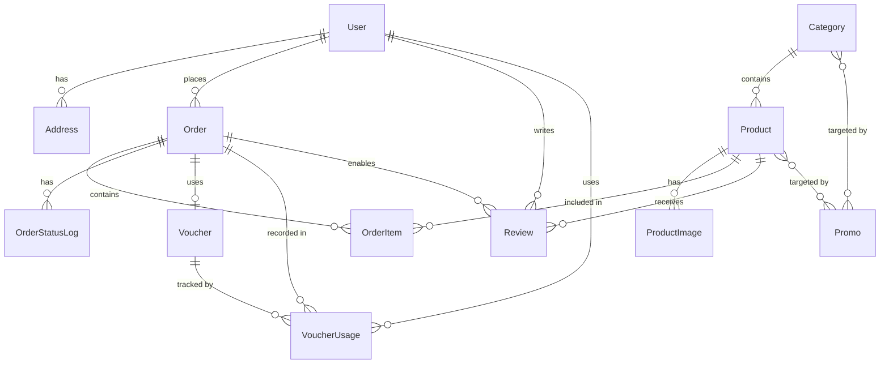
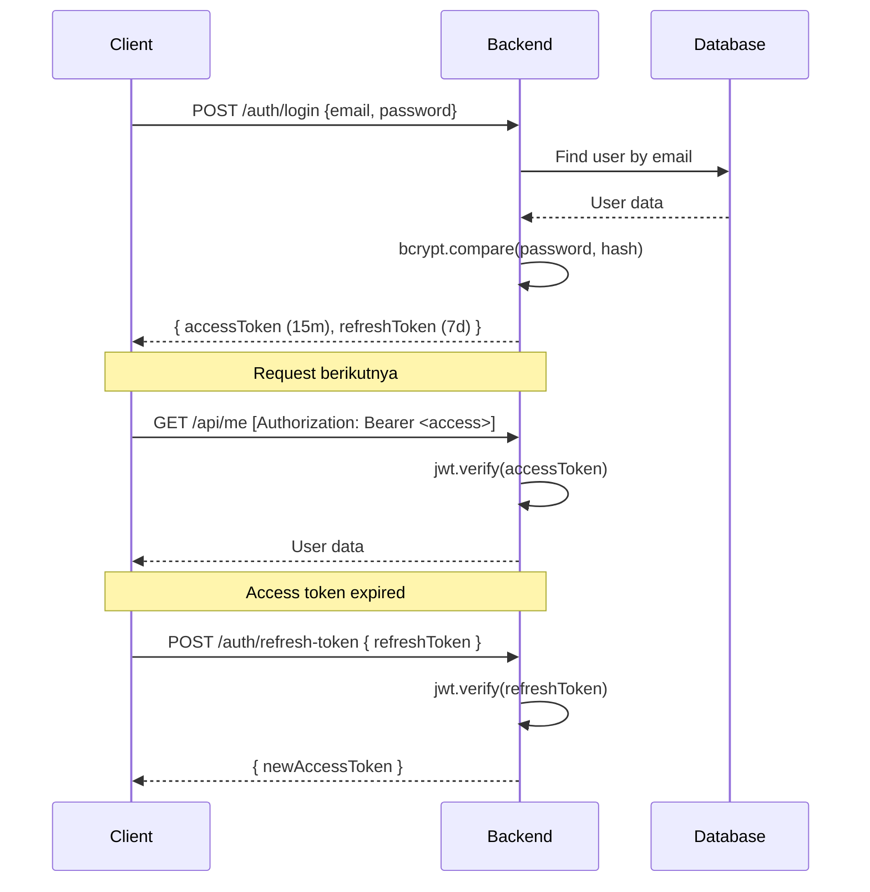
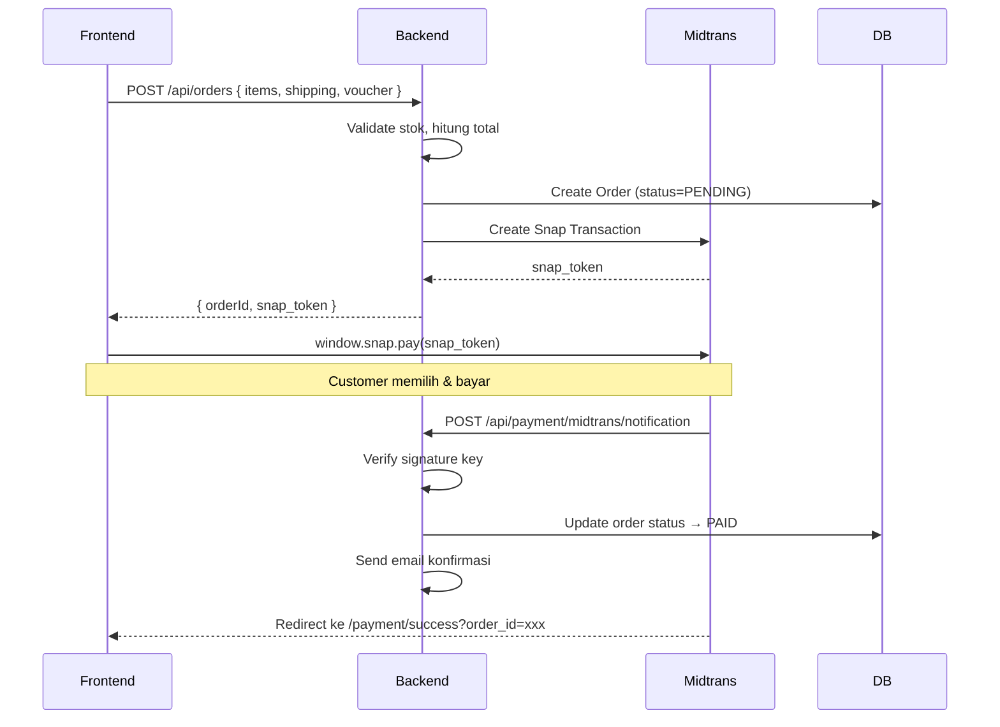

# 📋 Database & Backend Planning — Logam Mulia E-Commerce

> Dokumen ini adalah perencanaan teknis database dan backend berdasarkan PRD dan FE yang sudah ada.
> Stack: **Node.js + Express + TypeScript + Prisma + PostgreSQL**

---

## 1. Tech Stack Summary

| Layer | Technology |
|-------|-----------|
| Runtime | Node.js + TypeScript |
| Framework | Express.js |
| ORM | Prisma v5 |
| Database | PostgreSQL |
| Auth | JWT (Access 15m + Refresh 7d) |
| Payment | Midtrans Snap |
| Shipping | RajaOngkir API |
| Email | Nodemailer / Resend |
| File Upload | Multer (local storage) |
| Validation | Zod |
| Security | Helmet, CORS, Rate Limit, bcryptjs |

---

## 2. Database Schema (Prisma)

Schema Prisma yang sudah ada di `backend/prisma/schema.prisma` sudah cukup solid. Di bawah ini adalah **analisis, gap, dan rekomendasi penyempurnaan**.

### 2.1 Status Schema yang Sudah Ada ✅

| Model | Status | Catatan |
|-------|--------|---------|
| `User` | ✅ Solid | role, KYC, multi-address sudah ada |
| `Address` | ✅ Solid | multi-address dengan isDefault |
| `Category` | ✅ Solid | slug, image, relasi promo |
| `Product` | ✅ Solid | kadar, weightGram, multi-image, isActive |
| `ProductImage` | ✅ Solid | sortOrder, isPrimary |
| `Order` | ✅ Solid | full lifecycle, Midtrans ID, KTP ref |
| `OrderItem` | ✅ Solid | priceAtPurchase dikunci saat beli |
| `Review` | ✅ Solid | isHidden untuk moderasi |
| `Voucher` | ✅ Solid | perUserLimit, usageCount |
| `Promo` | ✅ Solid | relasi ke product & category |
| `Setting` | ✅ Solid | key-value untuk CMS |

### 2.2 Gap yang Perlu Ditambahkan ⚠️

#### A. `VoucherUsage` — Tracking per-user usage
Voucher punya `perUserLimit`, tapi tidak ada tabel untuk track siapa sudah pakai berapa kali.

```prisma
model VoucherUsage {
  id        String  @id @default(uuid())
  voucherId String  @map("voucher_id")
  voucher   Voucher @relation(fields: [voucherId], references: [id])
  userId    String  @map("user_id")
  user      User    @relation(fields: [userId], references: [id])
  orderId   String  @map("order_id")
  usedAt    DateTime @default(now()) @map("used_at")

  @@unique([voucherId, userId, orderId])
  @@map("voucher_usages")
}
```

Tambahkan relasi di `Voucher`: `usages VoucherUsage[]`
Tambahkan relasi di `User`: `voucherUsages VoucherUsage[]`

#### B. `OrderStatusLog` — Audit trail perubahan status
Untuk tracking history status order (tampil di FE order detail).

```prisma
model OrderStatusLog {
  id        String      @id @default(uuid())
  orderId   String      @map("order_id")
  order     Order       @relation(fields: [orderId], references: [id])
  status    OrderStatus
  note      String?
  createdAt DateTime    @default(now()) @map("created_at")

  @@map("order_status_logs")
}
```

Tambahkan relasi di `Order`: `statusLogs OrderStatusLog[]`

#### C. Field tambahan di `Order`
```prisma
// Tambahkan di model Order:
shippingProvince  String?   @map("shipping_province")
shippingPostalCode String?  @map("shipping_postal_code")
shippingService   String?   @map("shipping_service")   // REG, YES, OKE
adminFee          Decimal   @default(0) @map("admin_fee") @db.Decimal(15,2)
notes             String?   // Catatan dari customer
cancelledAt       DateTime? @map("cancelled_at")
cancelReason      String?   @map("cancel_reason")
```

#### D. Field tambahan di `Review`
```prisma
// Tambahkan di model Review:
orderId   String  @map("order_id")  // Pastikan verified buyer
order     Order   @relation(fields: [orderId], references: [id])
updatedAt DateTime @updatedAt @map("updated_at")
```

#### E. Field tambahan di `User`
```prisma
// Tambahkan di model User:
isActive    Boolean  @default(true) @map("is_active")
lastLoginAt DateTime? @map("last_login_at")
refreshToken String?  @map("refresh_token")  // Atau buat tabel terpisah
```

#### F. `Banner` — Untuk CMS homepage carousel
```prisma
model Banner {
  id        String   @id @default(uuid())
  imageUrl  String   @map("image_url")
  linkUrl   String?  @map("link_url")
  title     String?
  sortOrder Int      @default(0) @map("sort_order")
  isActive  Boolean  @default(true) @map("is_active")
  createdAt DateTime @default(now()) @map("created_at")

  @@map("banners")
}
```

---

## 3. Entity Relationship Diagram



---

## 4. API Endpoint Plan

### 4.1 Auth (`/api/auth`)

| Method | Endpoint | Auth | Description |
|--------|----------|------|-------------|
| POST | `/register` | Public | Register customer baru |
| POST | `/login` | Public | Login, return access+refresh token |
| POST | `/logout` | JWT | Hapus refresh token |
| POST | `/refresh-token` | Refresh Token | Perbarui access token |
| GET | `/me` | JWT | Get current user profile |

### 4.2 Products (`/api/products`)

| Method | Endpoint | Auth | Description |
|--------|----------|------|-------------|
| GET | `/` | Public | List produk (filter, sort, paginate) |
| GET | `/:slug` | Public | Detail produk by slug |
| GET | `/search?q=` | Public | Search produk |
| POST | `/` | Admin | Buat produk baru + upload foto |
| PUT | `/:id` | Admin | Update produk |
| DELETE | `/:id` | Admin | Soft delete (isActive=false) |
| PUT | `/:id/images/reorder` | Admin | Reorder foto produk |
| DELETE | `/:id/images/:imageId` | Admin | Hapus foto produk |

### 4.3 Categories (`/api/categories`)

| Method | Endpoint | Auth | Description |
|--------|----------|------|-------------|
| GET | `/` | Public | List semua kategori |
| GET | `/:slug` | Public | Detail kategori |
| POST | `/` | Admin | Buat kategori baru |
| PUT | `/:id` | Admin | Update kategori |
| DELETE | `/:id` | Admin | Hapus kategori |

### 4.4 Cart — Stateless (FE-side)

> Cart dikelola di FE (localStorage). Backend hanya menerima cart items saat checkout.

### 4.5 Orders (`/api/orders`)

| Method | Endpoint | Auth | Description |
|--------|----------|------|-------------|
| GET | `/` | JWT | Order history customer |
| GET | `/:id` | JWT | Detail order customer |
| POST | `/` | JWT / Guest | Buat order baru + init Midtrans |
| POST | `/:id/cancel` | JWT | Cancel order (status PENDING) |
| POST | `/:id/confirm-delivery` | JWT | Customer konfirmasi terima |

### 4.6 Admin Orders (`/api/admin/orders`)

| Method | Endpoint | Auth | Description |
|--------|----------|------|-------------|
| GET | `/` | Admin | List semua order (filter, search, paginate) |
| GET | `/:id` | Admin | Detail order |
| PUT | `/:id/status` | Admin | Update status order |
| PUT | `/:id/tracking` | Admin | Input nomor resi |

### 4.7 Payment (`/api/payment`)

| Method | Endpoint | Auth | Description |
|--------|----------|------|-------------|
| POST | `/midtrans/notification` | Public (Webhook) | Callback dari Midtrans |
| GET | `/midtrans/status/:orderId` | JWT | Cek status pembayaran manual |

### 4.8 Shipping (`/api/shipping`)

| Method | Endpoint | Auth | Description |
|--------|----------|------|-------------|
| GET | `/provinces` | Public | List provinsi (RajaOngkir) |
| GET | `/cities?provinceId=` | Public | List kota |
| POST | `/cost` | Public | Hitung ongkos kirim |

### 4.9 Reviews (`/api/reviews`)

| Method | Endpoint | Auth | Description |
|--------|----------|------|-------------|
| GET | `/products/:productId` | Public | List review per produk |
| POST | `/` | JWT | Submit review (verified buyer) |
| PUT | `/:id/visibility` | Admin | Hide/unhide review |

### 4.10 Vouchers (`/api/vouchers`)

| Method | Endpoint | Auth | Description |
|--------|----------|------|-------------|
| POST | `/validate` | JWT | Validate & hitung diskon voucher |
| GET | `/` | Admin | List semua voucher |
| POST | `/` | Admin | Buat voucher baru |
| PUT | `/:id` | Admin | Update voucher |
| DELETE | `/:id` | Admin | Hapus voucher |

### 4.11 Promos (`/api/promos`)

| Method | Endpoint | Auth | Description |
|--------|----------|------|-------------|
| GET | `/` | Public | List promo aktif |
| POST | `/` | Admin | Buat promo baru |
| PUT | `/:id` | Admin | Update promo |
| DELETE | `/:id` | Admin | Hapus promo |

### 4.12 Users / Admin (`/api/admin/users`, `/api/admin/members`)

| Method | Endpoint | Auth | Description |
|--------|----------|------|-------------|
| GET | `/admin/members` | Admin | List semua customer |
| GET | `/admin/members/:id` | Admin | Detail customer + order history |
| GET | `/admin/admins` | Super Admin | List semua admin |
| POST | `/admin/admins` | Super Admin | Tambah admin baru |
| DELETE | `/admin/admins/:id` | Super Admin | Hapus admin |

### 4.13 Upload (`/api/upload`)

| Method | Endpoint | Auth | Description |
|--------|----------|------|-------------|
| POST | `/ktp` | JWT | Upload KTP customer |
| POST | `/product-image` | Admin | Upload foto produk |
| POST | `/banner` | Admin | Upload banner |

### 4.14 Banners & Settings (`/api/banners`, `/api/settings`)

| Method | Endpoint | Auth | Description |
|--------|----------|------|-------------|
| GET | `/banners` | Public | List banner aktif |
| POST | `/banners` | Admin | Upload banner baru |
| PUT | `/banners/:id` | Admin | Update banner |
| DELETE | `/banners/:id` | Admin | Hapus banner |
| GET | `/settings` | Admin | Semua settings |
| PUT | `/settings/:key` | Admin | Update satu setting |

### 4.15 Dashboard Stats (`/api/admin/dashboard`)

| Method | Endpoint | Auth | Description |
|--------|----------|------|-------------|
| GET | `/stats` | Admin | Total revenue, orders, member, produk |
| GET | `/recent-orders` | Admin | 10 order terbaru |

---

## 5. Folder Structure Backend

```
backend/src/
├── index.ts                    # Entry point
├── core/
│   ├── server.ts               # Express app setup
│   ├── config/
│   │   ├── database.ts         # Prisma client singleton
│   │   ├── midtrans.ts         # Midtrans config
│   │   ├── rajaongkir.ts       # RajaOngkir config
│   │   └── email.ts            # Nodemailer/Resend config
│   ├── middlewares/
│   │   ├── auth.middleware.ts  # JWT verify
│   │   ├── role.middleware.ts  # isAdmin, isSuperAdmin
│   │   ├── error.middleware.ts # Global error handler
│   │   ├── upload.middleware.ts # Multer config
│   │   └── validate.middleware.ts # Zod validation
│   └── utils/
│       ├── response.ts         # Standard API response format
│       ├── paginate.ts         # Pagination helper
│       ├── order-id.ts         # Generate INV-YYYYMMDD-XXX
│       └── hash.ts             # bcrypt helpers
│
├── features/
│   ├── auth/
│   │   ├── auth.routes.ts
│   │   ├── auth.controller.ts
│   │   ├── auth.service.ts
│   │   └── auth.schema.ts      # Zod schemas
│   ├── products/
│   │   ├── products.routes.ts
│   │   ├── products.controller.ts
│   │   ├── products.service.ts
│   │   └── products.schema.ts
│   ├── categories/
│   ├── orders/
│   │   ├── orders.routes.ts
│   │   ├── orders.controller.ts
│   │   ├── orders.service.ts
│   │   ├── orders.schema.ts
│   │   └── orders-admin.controller.ts
│   ├── payment/
│   │   ├── payment.routes.ts
│   │   ├── payment.controller.ts
│   │   └── payment.service.ts  # Midtrans integration
│   ├── shipping/
│   │   ├── shipping.routes.ts
│   │   ├── shipping.controller.ts
│   │   └── shipping.service.ts # RajaOngkir integration
│   ├── reviews/
│   ├── vouchers/
│   ├── promos/
│   ├── users/
│   ├── upload/
│   ├── banners/
│   ├── settings/
│   └── dashboard/
│
└── jobs/
    └── order-expiry.job.ts     # Cron: auto-cancel PENDING > 24 jam
```

---

## 6. Authentication & Authorization Flow



### Role & Permission Matrix

| Endpoint Type | CUSTOMER | ADMIN | SUPER_ADMIN |
|--------------|----------|-------|-------------|
| Browse catalog | ✅ | ✅ | ✅ |
| Checkout & order | ✅ | ✅ | ✅ |
| View own orders | ✅ | ✅ | ✅ |
| Manage products | ❌ | ✅ | ✅ |
| Manage orders | ❌ | ✅ | ✅ |
| Manage vouchers | ❌ | ✅ | ✅ |
| Manage promos | ❌ | ✅ | ✅ |
| View members | ❌ | ✅ | ✅ |
| Manage admins | ❌ | ❌ | ✅ |
| Settings | ❌ | ❌ | ✅ |

---

## 7. Midtrans Payment Integration



### Midtrans Notification Handler Logic

```
1. Terima POST dari Midtrans
2. Verify signature: SHA512(orderId+statusCode+grossAmount+serverKey)
3. Check transaction_status:
   - "settlement" / "capture" → status PAID
   - "pending" → status tetap PENDING
   - "deny" / "cancel" / "expire" → status CANCELLED
4. Update order di DB
5. Send email ke customer
6. Kurangi stock produk saat status PAID
```

---

## 8. Order Business Logic

### 8.1 Stock Management

```
Saat order PENDING  : JANGAN kurangi stok (mencegah ghost reservation)
Saat status → PAID  : Kurangi stok produk
Saat CANCELLED      : Kembalikan stok (jika sudah PAID sebelumnya)
```

### 8.2 Order ID Format

```
INV-{YYYYMMDD}-{4-digit-random}
Contoh: INV-20260511-4821
```

### 8.3 Auto-Cancel Job (Cron)

```
Setiap 15 menit, cek orders dengan:
- status = PENDING
- createdAt < now - 24 jam

→ Update ke CANCELLED
→ Send email cancellation
```

### 8.4 Voucher Validation Logic

```
1. Cek kode voucher exist & isActive
2. Cek periode (startsAt ≤ now ≤ expiresAt)
3. Cek usageLimit (usageCount < usageLimit || usageLimit = null)
4. Cek perUserLimit (user usage count < perUserLimit)
5. Cek minPurchase (subtotal ≥ minPurchase)
6. Hitung diskon:
   - PERCENTAGE: discount = subtotal * (discountValue/100), cap di maxDiscount
   - FIXED: discount = discountValue
```

---

## 9. Standard API Response Format

```typescript
// Success
{
  "success": true,
  "message": "Produk berhasil dibuat",
  "data": { ... },
  "meta": {              // Optional, untuk list dengan pagination
    "total": 100,
    "page": 1,
    "limit": 20,
    "totalPages": 5
  }
}

// Error
{
  "success": false,
  "message": "Produk tidak ditemukan",
  "errors": [           // Optional, untuk validation errors
    { "field": "price", "message": "Harga harus berupa angka positif" }
  ]
}
```

---

## 10. Implementation Priority (Sprint Plan)

### Sprint 1 — Foundation (Week 1-2)
- [ ] Setup Express + TypeScript + Prisma
- [ ] Database migration (schema + gap fixes)
- [ ] Auth system (register, login, JWT, refresh)
- [ ] Middleware (auth, role, error handler, validator)
- [ ] Standard response util

### Sprint 2 — Core Catalog (Week 3-4)
- [ ] Categories CRUD (admin)
- [ ] Products CRUD + image upload (admin)
- [ ] Products listing + detail (public)
- [ ] Search & filter produk

### Sprint 3 — Transaksi (Week 5-6)
- [ ] Shipping (RajaOngkir integration)
- [ ] Voucher validation endpoint
- [ ] Order creation
- [ ] Midtrans Snap integration
- [ ] Payment webhook handler
- [ ] Email notifications

### Sprint 4 — Admin & Polish (Week 7-8)
- [ ] Admin order management (list, detail, update status, resi)
- [ ] Order status log
- [ ] Auto-cancel cron job
- [ ] Review system
- [ ] Dashboard stats endpoint

### Sprint 5 — CMS & Extras (Week 9-10)
- [ ] Banner management
- [ ] Settings CMS
- [ ] Member management (admin)
- [ ] Admin management (super admin)
- [ ] Promo management

---

## 11. Key Technical Decisions

| Decision | Choice | Rationale |
|----------|--------|-----------|
| Cart storage | FE localStorage | Simplicity MVP, no server-side cart needed |
| KTP storage | Local disk (`/uploads`) | Enkripsi opsional Phase 2, local aman untuk MVP |
| Image storage | Local disk | Phase 2 bisa migrate ke S3/Cloudinary |
| Refresh token | DB column di User | Simple untuk MVP, bisa migrate ke Redis |
| Stock deduction | Saat PAID | Hindari ghost reservation, Midtrans webhook reliable |
| Order ID | Custom INV-format | Tidak expose sequential ID, user-friendly |

---

> [!IMPORTANT]
> **Prioritas absolut MVP**: Alur checkout → Midtrans webhook → Update status PAID harus sempurna dan ter-test sebelum fitur lain.

> [!TIP]
> Gunakan Midtrans **sandbox** selama development. Test semua skenario: success, pending, expired, dan deny.
