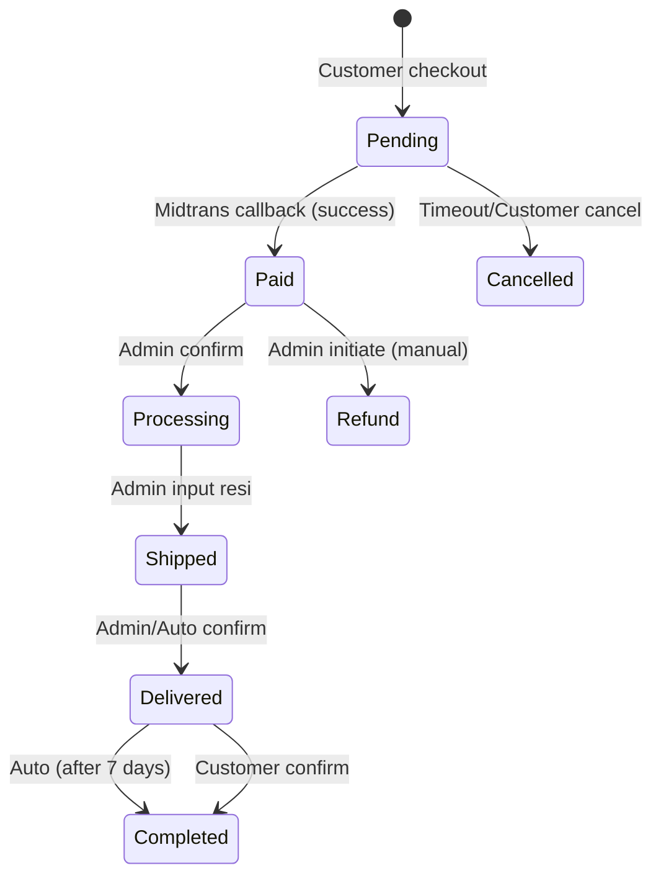
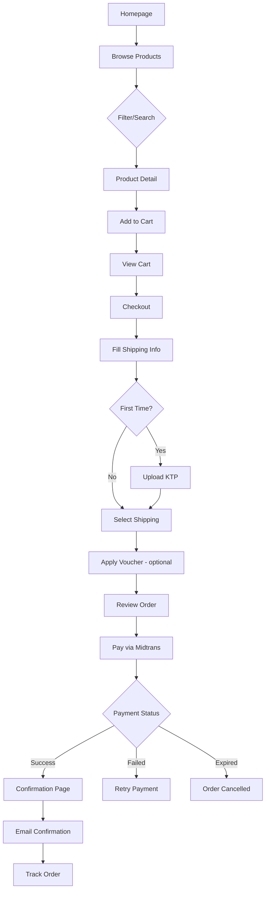
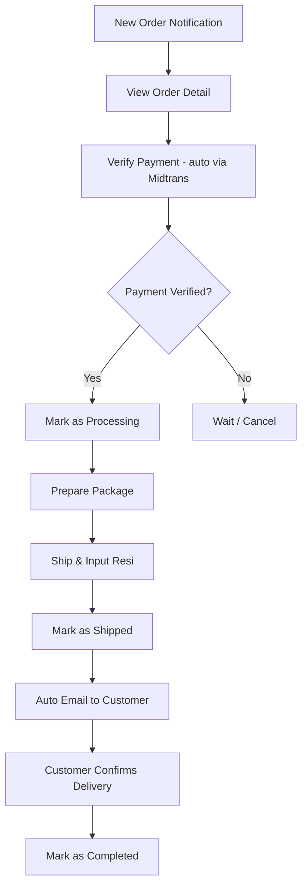
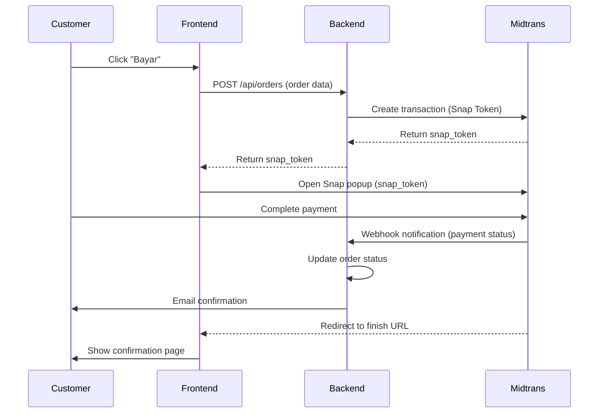

# PRD - Toko Emas Online
## Part 2: Product Specifications

---

## 5. Functional Requirements

### 5.1 User Features (Customer-Facing)

#### 5.1.1 Product Catalog & Filtering

| Feature | Detail |
|---------|--------|
| Product listing | Grid/list view, pagination, sort (harga, terbaru, populer) |
| Category filter | Emas Batangan, Perhiasan, Logam Mulia, dll |
| Search | Keyword search (nama produk, kadar, kategori) |
| Product detail | Multi-foto (3-5), deskripsi, spesifikasi (berat, kadar), harga, stok, review |
| Related products | Tampilkan produk serupa di halaman detail |

#### 5.1.2 Shopping Cart & Checkout

| Feature | Detail |
|---------|--------|
| Add to cart | Qty selector, update qty, remove item |
| Cart page | Summary items, subtotal, estimasi ongkir |
| Checkout | Form: alamat pengiriman, pilih shipping method, upload KTP |
| Shipping options | Raja Ongkir (JNE/J&T/Pos), Paxel (manual input ongkir), Self pickup |
| Voucher input | Apply voucher code di checkout |
| Payment | Redirect ke Midtrans Snap |
| Order confirmation | Halaman sukses + email konfirmasi |

#### 5.1.3 User Account & Order History

| Feature | Detail |
|---------|--------|
| Register | Email, nama, phone, password |
| Login | Email + password |
| Profile | Edit nama, phone, alamat (multi-address) |
| Order history | List semua order + status tracking |
| Order detail | Items, payment status, shipping tracking no |

#### 5.1.4 Review System

| Feature | Detail |
|---------|--------|
| Write review | Rating 1-5 bintang, text, upload foto (optional) |
| Eligibility | Verified buyer only (order status = delivered) |
| Display | Di product detail page, avg rating, total review |
| Moderation | Admin bisa hide/unhide review |

---

### 5.2 Admin Features (Backend/CMS)

#### 5.2.1 Product Management

| Feature | Detail |
|---------|--------|
| CRUD product | Create, Read, Update, Delete |
| Multi-foto | Upload 3-5 foto per produk (drag & reorder) |
| Fields | Nama, kategori, harga, berat (gram), kadar, deskripsi, stok, status (active/inactive) |
| Bulk action | Activate/deactivate multiple products |

#### 5.2.2 Category Management

| Feature | Detail |
|---------|--------|
| CRUD category | Nama, deskripsi, gambar, slug (URL-friendly) |
| Hierarchy | Flat structure (no nested) untuk MVP |
| Product count | Tampilkan jumlah produk per kategori |

#### 5.2.3 Order Management & Fulfillment

| Feature | Detail |
|---------|--------|
| Order list | Filter by status, search by order ID/customer |
| Status flow | `pending` → `paid` → `processing` → `shipped` → `delivered` → `completed` |
| Cancel flow | `pending` → `cancelled` (by customer/admin), `paid` → `refund` (manual process) |
| Update status | Admin update manual + input resi (tracking number) |
| Order detail | Customer info, items, payment info, shipping info, KTP preview |
| Email trigger | Auto email saat status berubah |

**Order Status Flow Diagram:**

#### 5.2.4 Promo Management

| Feature | Detail |
|---------|--------|
| Discount type | Percentage (%) atau Fixed amount (Rp) |
| Apply to | Per produk atau per kategori |
| Period | Start date & end date |
| Display | Harga coret di product listing/detail |

#### 5.2.5 Voucher Management

| Feature | Detail |
|---------|--------|
| CRUD voucher | Kode unik, tipe diskon (% / Rp), min. purchase, max discount |
| Usage limit | Total usage limit & per-customer limit |
| Period | Start date & end date |
| Status | Active / inactive / expired |

#### 5.2.6 Admin & Member Management

| Feature | Detail |
|---------|--------|
| Admin CRUD | Tambah admin, set role (super_admin / admin) |
| Permissions | Super admin = full access, Admin = limited (no delete, no admin management) |
| Member list | View all customers, search, filter |
| Member detail | Profile info, order history, total spent |

#### 5.2.7 Company Profile CMS

| Feature | Detail |
|---------|--------|
| Homepage banner | Upload/ganti banner images (carousel) |
| About us | Edit text + gambar |
| Contact info | Alamat, phone, email, maps embed |
| Social media links | Instagram, Facebook, etc |
| Footer content | Editable text |

#### 5.2.8 Biaya Management (Placeholder)

| Feature | Detail |
|---------|--------|
| Biaya admin | Set fixed fee per transaksi (jika ada) |
| Note | Placeholder — detail flow ditentukan kemudian |

---

### 5.3 System Features (Technical)

#### 5.3.1 Payment Gateway (Midtrans)

| Feature | Detail |
|---------|--------|
| Integration | Midtrans Snap (popup/redirect) |
| Payment methods | Bank Transfer (VA), E-wallet (GoPay, ShopeePay), QRIS |
| Webhook | Auto-update order status on payment success/failure/expire |
| Expiry | Payment link expire setelah 24 jam |
| Sandbox | Development pakai sandbox Midtrans |

#### 5.3.2 Shipping

| Feature | Detail |
|---------|--------|
| Raja Ongkir | Free tier API — cek ongkir JNE, POS, TIKI |
| Manual shipping | Paxel & kurir lain — admin input ongkir manual |
| Self pickup | Customer pilih ambil di toko (ongkir = 0) |
| Tracking | Admin input no resi, customer lihat di order detail |

#### 5.3.3 Email Notifications

| Trigger | Recipient | Content |
|---------|-----------|---------|
| Registration | Customer | Welcome email |
| Order created | Customer + Admin | Order summary |
| Payment success | Customer | Payment confirmation |
| Order shipped | Customer | Tracking number |
| Order delivered | Customer | Delivery confirmation + review prompt |
| Order cancelled | Customer | Cancellation notice |

#### 5.3.4 KTP Upload & Storage

| Feature | Detail |
|---------|--------|
| Upload | Required saat pertama kali checkout |
| Format | JPG/PNG, max 5MB |
| Storage | Encrypted, server-side |
| Access | Admin only (di order detail) |
| Purpose | Compliance untuk transaksi logam mulia |

---

## 6. User Stories & Acceptance Criteria

### Customer Stories

**US-01: Browse Products**
> As a customer, I want to browse products by category, so that I can find products I'm interested in.

**Acceptance Criteria:**
- [ ] Products displayed in grid with foto, nama, harga, kadar
- [ ] Filter by category works
- [ ] Sort by harga (low-high, high-low) & terbaru works
- [ ] Pagination loads correctly

**US-02: Product Detail**
> As a customer, I want to see detailed product information, so that I can make an informed purchase decision.

**AC:**
- [ ] Multiple photos with gallery/carousel
- [ ] Specifications: berat, kadar, harga
- [ ] Stock availability shown
- [ ] Reviews & average rating displayed
- [ ] Add to cart button functional

**US-03: Checkout & Payment**
> As a customer, I want to checkout and pay securely, so that I can complete my purchase.

**AC:**
- [ ] Cart summary accurate (items, qty, subtotal)
- [ ] Shipping address form with validation
- [ ] Shipping method selection with calculated cost
- [ ] KTP upload required (first time)
- [ ] Voucher code input functional
- [ ] Midtrans payment popup appears
- [ ] Order confirmation page after success
- [ ] Email received after payment

**US-04: Track Order**
> As a customer, I want to track my order status, so that I know when my product will arrive.

**AC:**
- [ ] Order status visible in order history
- [ ] Tracking number displayed when shipped
- [ ] Status timeline/progress indicator shown

**US-05: Write Review**
> As a customer, I want to write a review after receiving my product, so that I can share my experience.

**AC:**
- [ ] Review form only appears for delivered orders
- [ ] Can submit rating (1-5) + text + optional photo
- [ ] Review appears on product page after submission

---

### Admin Stories

**US-06: Manage Products**
> As an admin, I want to manage products (CRUD), so that the catalog stays up to date.

**AC:**
- [ ] Create product with all required fields + multi-photo upload
- [ ] Edit product info & replace/reorder photos
- [ ] Delete/deactivate product
- [ ] Product changes reflected on frontend immediately

**US-07: Process Orders**
> As an admin, I want to process and fulfill orders, so that customers receive their products.

**AC:**
- [ ] Order list with status filter
- [ ] Can update order status step by step
- [ ] Can input tracking number when shipping
- [ ] Email auto-sent on status change
- [ ] Can view customer KTP

**US-08: Manage Promos & Vouchers**
> As an admin, I want to create promos and vouchers, so that I can attract more customers.

**AC:**
- [ ] Create promo with discount type, value, period, target (product/category)
- [ ] Create voucher with unique code, limits, period
- [ ] Promo reflects as harga coret on frontend
- [ ] Voucher applies at checkout correctly

---

## 7. User Flows

### 7.1 Customer Purchase Flow

### 7.2 Admin Order Processing Flow

### 7.3 Payment Flow (Midtrans Integration)

